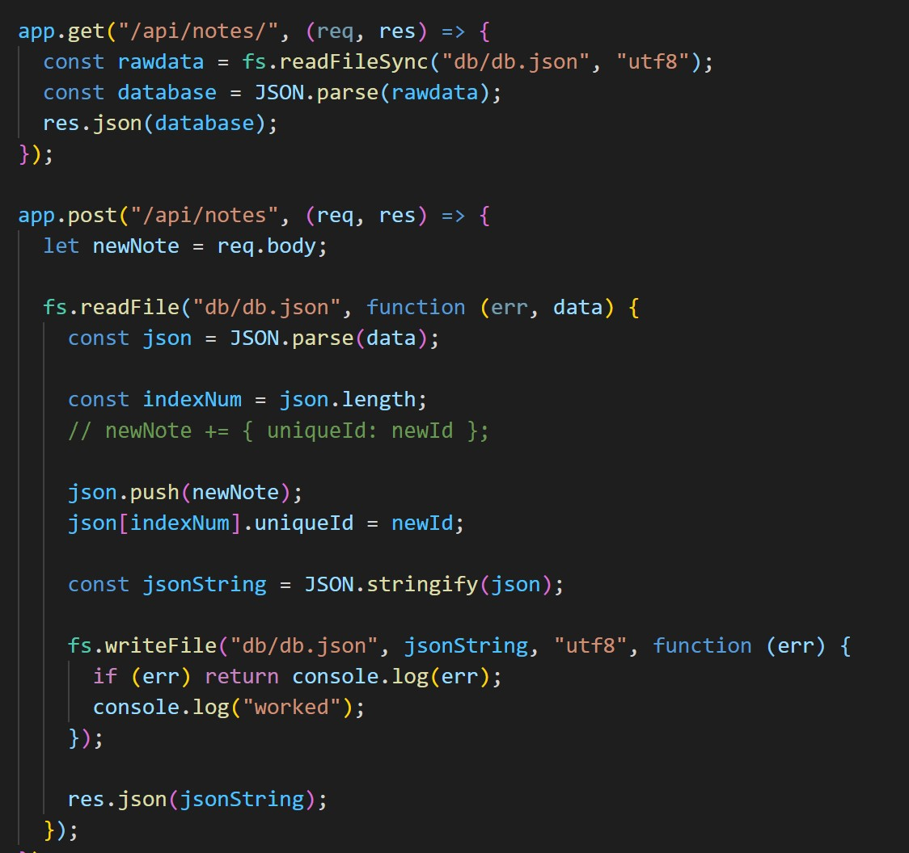
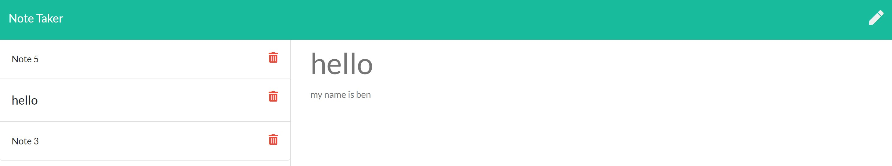

# Note Taker

## Description

This project uses the express and generate-unique-id packages to allow users to take notes and have them saved using server side data.

## Table Of Contents

- [Installation](##Installation)
- [Usage](##Usage)
- [License](##License)
- [Contributing](##Contributing)
- [Tests](##Tests)
- [Questions](##Questions)

## Installation

In the back end, the express package is used to facilitate the production of this web-application. It is used to display the front end html at different path routes. in the rout /notes, users can inout a new note, save the note to the side and write a new note. The front end uses fetch to grab the user input and display it on the left side as a saved note that can be clicked on to be read.

## Usage

The above image shows the code for getting the new input and adding it to the db.json file to be read and displayed in the saved notes. The image below shows an example of the web application. There is also a feature where you can delete a saved notes by going to the relative file path of /api/notes/'unique id' which will delete the note that has the same id as the http path 'unqiue id'

## License

This project is covered under the MIT License

## Contributing

[bencyna](https://github.com/bencyna/)

## Tests

Go to the deployed application [here](https://agile-island-96513.herokuapp.com/)

## Questions

If you have any questions about this project, you can veiw my github account at https://github.com/bencyna or email me at benjamincyna@gmail.com
